---
jupytext:
  notebook_metadata_filter: all
  text_representation:
    extension: .md
    format_name: myst
    format_version: 0.13
    jupytext_version: 1.11.2
kernelspec:
  display_name: Python 3
  language: python
  name: python3
language_info:
  codemirror_mode:
    name: ipython
    version: 3
  file_extension: .py
  mimetype: text/x-python
  name: python
  nbconvert_exporter: python
  pygments_lexer: ipython3
  version: 3.8.5
---

# Tutorial: Dinitz's algorithm and its applications
In this tutorial, we will introduce [Maximum flow problem](https://en.wikipedia.org/wiki/Maximum_flow_problem) 
and [Dinitz's algorithm](https://en.wikipedia.org/wiki/Dinic%27s_algorithm) [^1], which is implimented at 
[algorithms/flow/dinitz_alg.py](https://github.com/networkx/networkx/blob/main/networkx/algorithms/flow/dinitz_alg.py) 
in NetworkX. We will also see how it can be used to solve some interesting problems.

## Maximum flow problem

### Motivation
Let's say you want to send your friend some data as soon as possible, but the only way 
of communication/sending data between you two is through a peer-to-peer network. An 
interesting thing about this peer-to-peer network is that it allows you to send data 
along the paths you specify with certain limits on the sizes of data per second that 
you can send between a pair of nodes in this network.

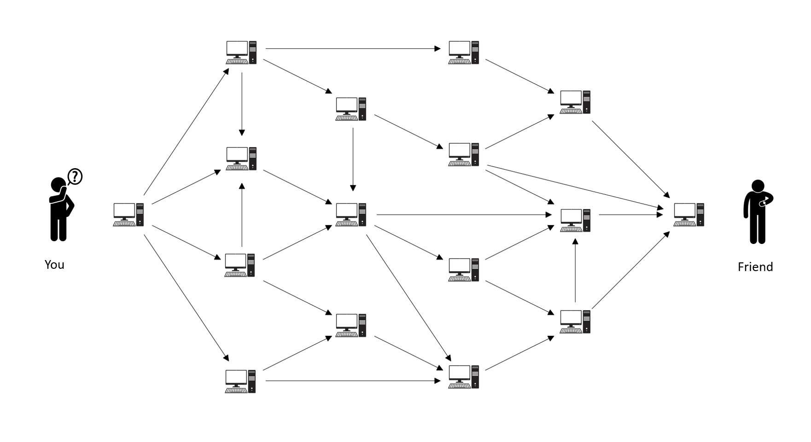

So how shall you plan the paths of the data packets to send them in the least amount 
of time?

Note that here we can divide the data into small data packets and send it across the 
network and the receiver will be able to rearrange the data packets to reconstruct 
the original data.

### Formalization
So how can we model this problem in terms of graphs?

Let's say $N=(V, E)$ represents this peer-to-peer network with $V$ as the set of nodes 
where nodes are computers and $E$ as the set of edges where edge $uv \in E$ if there is 
a connection from node $u$ to node $v$ across which we can send data. There are also  
2 special nodes first one is the one on which you are there, call it $s$ & the second 
being the one with your friend call it $t$. We also name them ***source*** and ***sink*** 
nodes respectively.

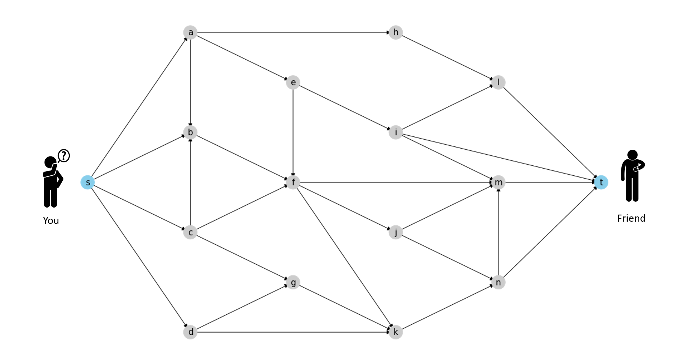

Now say that node $u$ and node $v$ are connected and the maximum data per second that 
you can send from node $u$ to node $v$ is $c_{uv}$, lets call this as capacity of the edge $uv$.

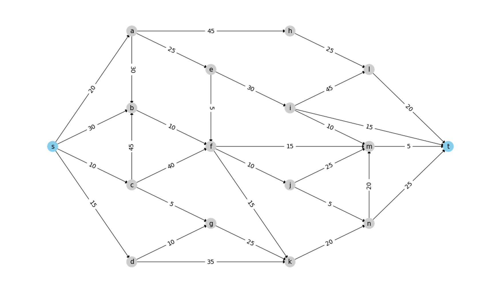

So before go ahead and plan the paths on which we will be sending the data packets, 
we need some way to represent or plan on the network. Observe that any plan will have 
to take up some capacity of the edges, so we can represent the plan by the values of 
the capacity taken by it for each edge in E, let's call the plan as **flow**.Formally, 
we can define flow as $f: E \to \mathbb{R}$ i.e. a mapping from edges $E$ to real numbers 
denoting that we are sending data at rate $f(uv)$ through edge $uv\in E$.

Note that for this plan to be a valid plan it must satisfy the following constraints
* **Capacity constraint:**
    The data rate at which we are sending data from any node doesn't exceed its 
    capacity, formally $f_{uv} \le c_{uv}$
* **Conservation of flow:**
    Rate at which data is sent to a node is same as the rate at which the node is sending 
    data to other nodes, except for the source $s$ and sink $t$ nodes. Formally 
    $\sum\limits_{u|(u,v) \in E}f_{u,v} = \sum\limits_{w|(v,w) \in E}f_{v,w} $ for
    $v\in V\backslash \{s,t\}$

example of valid flow:
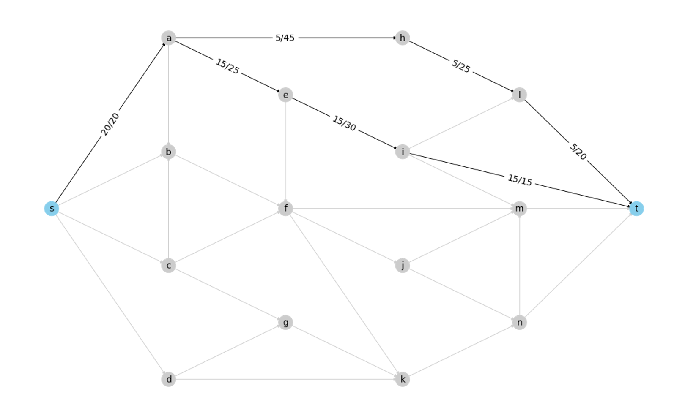

example of invalid flow:
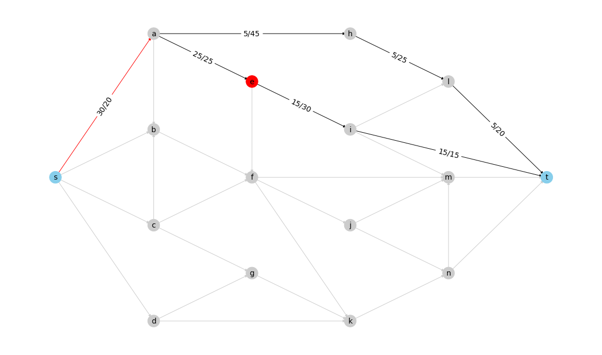

red color edges dont satisfy capacity constraint and red color nodes dont satisfy the 
conservation of flow

*So if we use this plan/flow to send data then at what rate will we be sending the data to friend?*

To answer it we need to observe that any data that the sink node $t$ will receive will be 
from its neighbors so if we sum over the data rates from plan/flow from those neighbors to 
the sink node we shall get the total data rate at which $t$ will be receiving the data. 
Formally we can say that the **value of the flow** is $|f|=\sum\limits_{u|(u,t) \in E}f_{u,t}$. 
Also note that since flow is conservative $|f|$ would also be equal to $\sum\limits_{u|(s,u) \in E}f_{s,u}$.

Remember our goal was to maximize the rate at which the data is being sent to our friend, 
which is the same as maximizing the flow value $|f|$.

This is the definition of the **Maximum Flow Problem**.

## Dinitz's algorithm

Before understanding how Dinitz's algorithm works and its steps let's define some terms.

### Residual Capacity & Graph
If we send $f_{uv}$ flow through edge $uv$ with capacity $c_{uv}$, then we define residual 
capacity by $g_{uv}=c_{uv}-f_{uv}$ and residual network by $N'$ which only considers the 
edges of $N$ if they have non-zero residual capacity.

example flow:
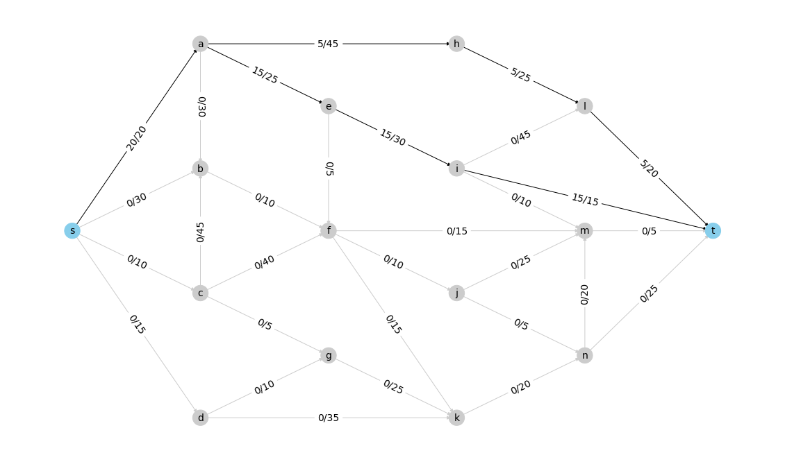

This is the residual network for the flow shown above:
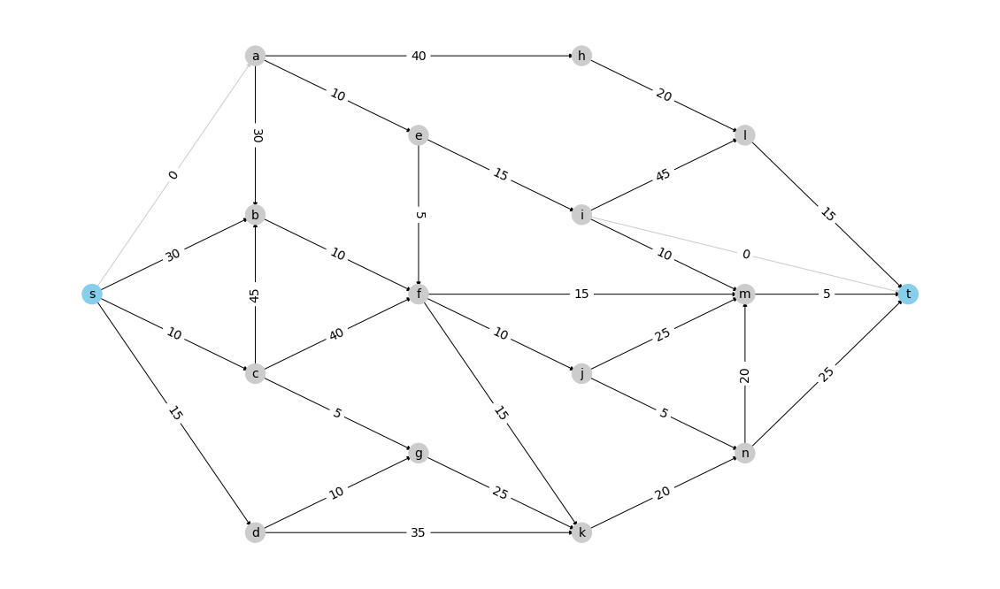

### Level Network

The level network is a subgraph of the residual network which we get when we apply 
[BFS](https://en.wikipedia.org/wiki/Breadth-first_search) from source node $s$ to divide 
the nodes into levels and only consider the edges to be in the level network $L$ which 
connect nodes of 2 different levels.

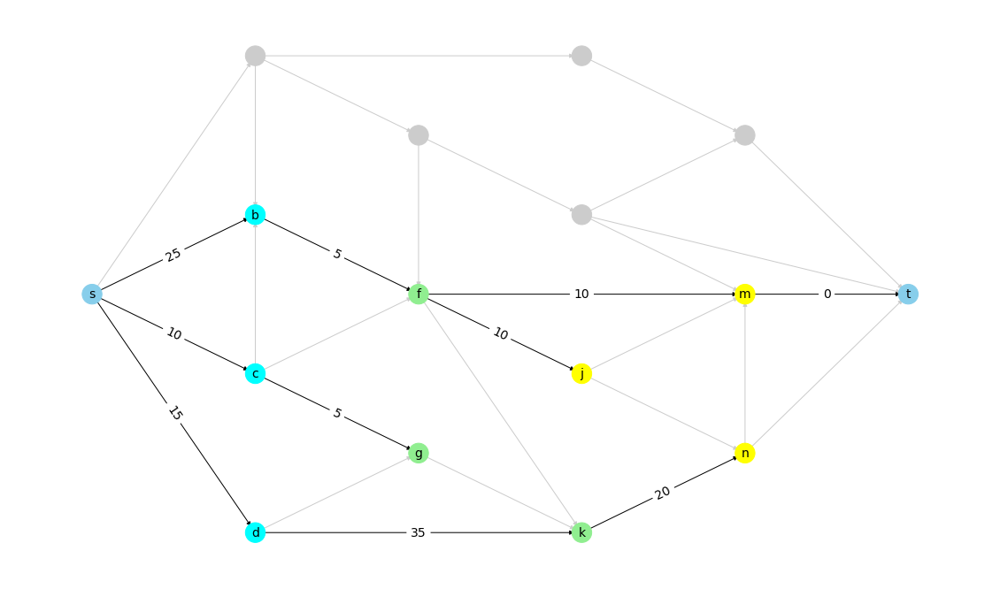

Note that if sink node $t$ is not reachable from the source node $s$ that means that no 
more flow can be pushed through the residual network.

### Augmenting Path & Flow

An augmenting path $P$ is a path from source node $s$ to sink node $t$ such that all 
the edges on the path have positive residual capacity i.e. $g_{uv}>0$ for $uv \in P$

and augmenting flow $\alpha$ for that path $P$ is the minimum value of the residual 
flow across all the edges of $P$. i.e. $\alpha = min\{g_{uv}, uv \in P\}$.

And by augmenting the flow along path $P$ we mean that reduce the residual capacities 
of the edges in path $P$ by $\alpha$ which will leave atleast one of the edges on the 
residual network with zero residual capacity.

We find augmenting paths by applying [DFS](https://en.wikipedia.org/wiki/Depth-first_search) 
on the Level network $L$.

Augmenting path:


Augmenting path after augmenting:
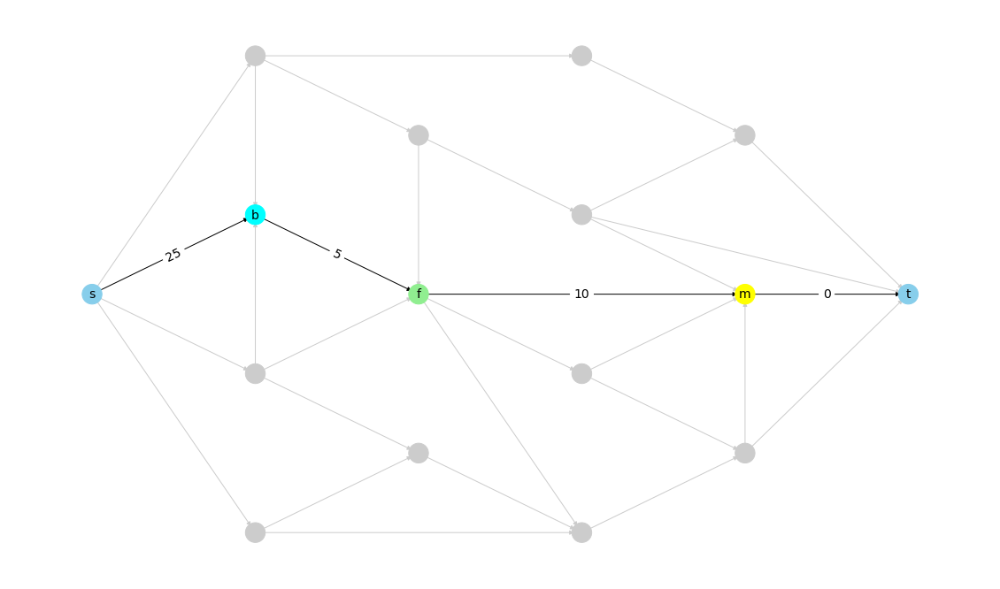

Resulting new residual Network:
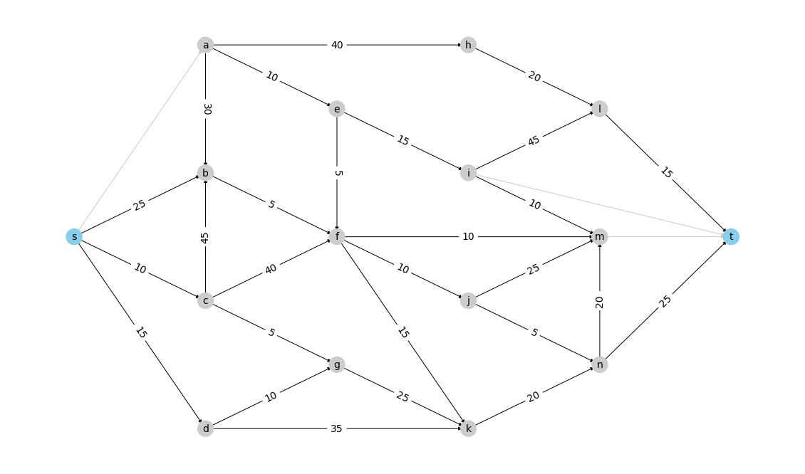

### Algorithm

1. Initialize flow with zero value, $f_{uv}=0$
2. Construct a residual network  $N'$ form that flow
3. Find level network $L$ using BFS, if $t$ not there is a level network then break and 
output the flow
4. Find augmenting path $P$ in level network $L$
5. Augment the flow along the edges of path $P$ which will give a new residual network
6. Repeat from point 3 with new residual network $N'$

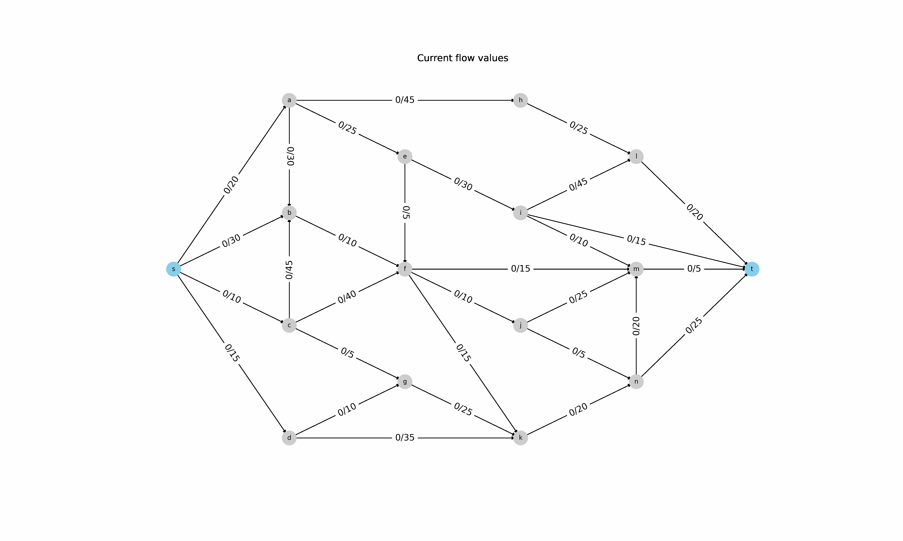

```{code-cell} ipython3
%matplotlib inline
import networkx as nx
import matplotlib.pyplot as plt
import pickle
```

```{code-cell} ipython3
gname = "egnetwork"
# loading the graph
G = nx.read_graphml(f"data/{gname}.graphml")
with open(f"data/pos_{gname}", "rb") as fp:
    pos = pickle.load(fp)
```

```{code-cell} ipython3
fig, axes = plt.subplots(4, 2, figsize=(20, 30))

# assign colors and labels to nodes based on their type
color_map = {"t": "skyblue", "s": "skyblue"}
node_colors = [color_map[u] if u in color_map.keys() else "0.8" for u in G.nodes]
node_labels = {u: u for u in G.nodes}
cutoff_list = [5, 10, 15, 20, 25, 30, 35, 40]

for i in range(8):

    # calculating the maximum flow with the cutoff value
    R = nx.flow.dinitz(G, s="s", t="t", capacity="capacity", cutoff=cutoff_list[i])

    # coloring and labeling edges depending on if they have non-zero flow value or not
    edge_colors = ["0.8" if R[u][v]["flow"] == 0 else "0" for u, v in G.edges]
    edge_labels = {
        (u, v): f"{R[u][v]['flow']}/{G[u][v]['capacity']}"
        for u, v in G.edges
        if R[u][v]["flow"] != 0
    }

    # drawing the network
    nx.draw_networkx_nodes(
        G, pos=pos, ax=axes[i // 2][i % 2], node_size=500, node_color=node_colors
    )
    nx.draw_networkx_labels(
        G, pos=pos, ax=axes[i // 2][i % 2], labels=node_labels, font_size=14
    )
    nx.draw_networkx_edges(G, pos=pos, ax=axes[i // 2][i % 2], edge_color=edge_colors)
    nx.draw_networkx_edge_labels(
        G, pos=pos, ax=axes[i // 2][i % 2], edge_labels=edge_labels, font_size=14
    )
    axes[i // 2][i % 2].set_title(
        f"Max Flow = {R.graph['flow_value']}\nCutoff value of = {cutoff_list[i]}",
        size=15,
    )

fig.tight_layout()
```

Note: Iteration are stopped if the maximum flow found so far exceeds the cutoff value
## Reductions and Applications
There are many other problems which can be reduced to Maximum flow problem for eg.
* [Maximum Bipartite Matching](https://en.wikipedia.org/wiki/Matching_(graph_theory))
* [Assignment Problem](https://en.wikipedia.org/wiki/Assignment_problem)
* [Transportation Problem](https://en.wikipedia.org/wiki/Transportation_theory_(mathematics))

and many others

Note that even though dinitz works in $O(n^2m)$ strongly polynomial time, i.e. to say it 
doesn't depend on the value of flow. It is noteworthy that its performance of biparted 
graphs is especially fast being $O(\sqrt n m)$ time, where $n = |V|$ & $m = |E|$.

Lets consider the example of shipping packages from warehouse to customers through some 
intermediate shipping points, and we can only ship limited number of packages through 
an intermediate shipping point in a day.

So how to assign intermediate shipping point to customer so that maximum number of 
packages are shipped in a day?

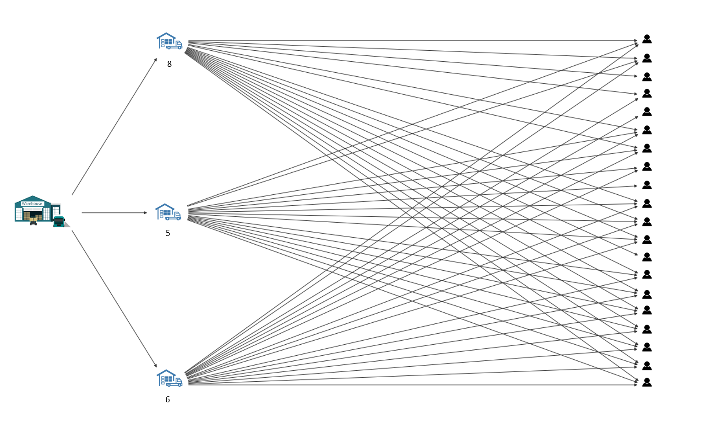

Number below each intermediate shipping point is the maximum number of shipping that 
it can do in a day, and if edge connects an intermdiate shipping point and a customer 
only then we can send the package from that shipping point to that customer.

Note that the wharehouse node is named as $W$, intermediate shipping points as 
$lw1, lw2, lw3$, and customers as $c1,c2...c20$.

```{code-cell} ipython3
gname = "shipping-graph"
# loading the graph
B = nx.read_graphml(f"data/{gname}.graphml")
with open(f"data/pos_{gname}", "rb") as fp:
    pos = pickle.load(fp)
```

```{code-cell} ipython3
# drawing the loaded graph
node_colors = ["skyblue" if u == "W" else "0.8" for u in B.nodes]
plt.figure(figsize=(20, 10))
nx.draw(
    B, pos=pos, node_color=node_colors, with_labels=True, arrowsize=10, node_size=800
)
plt.show()
```

```{code-cell} ipython3
# maximum shipping capacities
{u: B.nodes[u] for u in ["lw1", "lw2", "lw3"]}
```

Lets add a pseudo node as $T$ for denoting sink node and add edges from 
$ci \to T$, $i\in\{1,2,...,20\}$. Note that shipping any more than the maximum 
number of packages that any of $lwi$, $i\in\{1,2,3\}$ can ship on that day is useless. 
So we can transfer that maximum number of shipping to a maximum capacity of the 
edges $W\to lwi$, $i\in\{1,2,3\}$ and for all other edges, we can assign its capacity 
as 1 we only need to do one shipment per customer.

Note: We have already assigned the position to node $T$ in `pos` which was loaded earlier.

```{code-cell} ipython3
# adding node T and edges to T from c1,c2,...c20
B.add_node("T")
B.add_edges_from([("c" + str(i), "T") for i in range(1, 21)])

# adding capacities from W to lw1, lw2, lw3
for u in ["lw1", "lw2", "lw3"]:
    B["W"][u]["capacity"] = B.nodes[u]["maximum shippings"]

# adding capacities as 1 for all other edges except edges from W
for u, v in B.edges:
    if u != "W":
        B[u][v]["capacity"] = 1
```

```{code-cell} ipython3
# assign colors and labels to nodes based on their type
color_map = {"W": "skyblue", "T": "skyblue"}
node_colors = [color_map[u] if u in color_map.keys() else "0.8" for u in B.nodes]
node_labels = {u: u for u in B.nodes}

# calculating the maximum flow with the cutoff value
R = nx.flow.dinitz(B, s="W", t="T", capacity="capacity")

# coloring and labeling edges depending on if they have non-zero flow value or not
edge_colors = ["0.8" if R[u][v]["flow"] == 0 else "0" for u, v in B.edges]

# drawing the network
plt.figure(figsize=(20, 10))
nx.draw_networkx_nodes(B, pos=pos, node_size=400, node_color=node_colors)
nx.draw_networkx_labels(B, pos=pos, labels=node_labels, font_size=8)
nx.draw_networkx_edges(B, pos=pos, edge_color=edge_colors)
plt.title(f"Max Flow = {R.graph['flow_value']}", size=12)
plt.axis("off")
plt.show()
```

Above we can see a matching of intermediate shipping points and customers which 
gives the maximum shipping in a day
## References
[^1]: Dinitz' Algorithm: The Original Version and Even's Version. 2006. Yefim Dinitz. 
In Theoretical Computer Science. Lecture Notes in Computer Science. 
Volume 3895. pp 218-240. <https://doi.org/10.1007/11685654_10>
